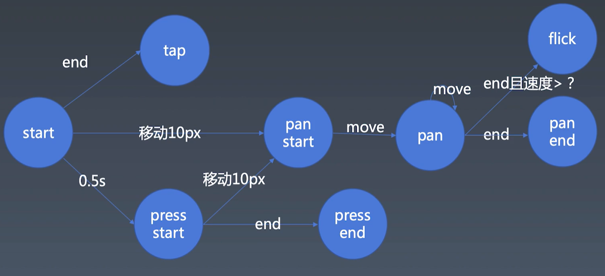

学习笔记

### 动画库与组件结合

PC端鼠标事件：鼠标按下、移动、松开
手机端touch事件：touch开始、移动、结束、取消
> touchcancel 的触发时机, 是touch事件过程中打断, 如弹窗等。

**手机端touch处理逻辑**
- tap 包含 touchstart, touchmove, touchend;
- touchstart 触发时同时触发 tap press;
- touchmove 产生且移动 > 10px, 移动 pan 产生, 取消 tap, press;
- touchend 触发存在的事件 tap press pan 其中之一;ss

**pc端鼠标事件**
- mousedown 鼠标按下 对应触发 touchstart 
- mousemove 鼠标移动 对应触发 touchmove
- mouseup 鼠标抬起 对应触发 touchend
- 多个键按下后 mouseup 被触发多次处理

**flick/swipper**
- 手势划过, 带速度判断

> tips: 左移和右移值快速计算
>> 左移 << N 值 * 2^N指数倍  4 << 3 = 4 * 2^3 = 32 
>> 右移 >> N 值 / 2^N   64 >> 4 = 64 / 16 = 4 

> tips: 
> MouseEvent.button: 只读, 返回一个数值：(如果是左手使用的鼠标数值相反)
>> 0：主按键，通常指鼠标左键或默认值
>> 1：辅助按键，通常指鼠标滚轮中键
>> 2：次按键，通常指鼠标右键
>> 3：第四个按钮，通常指浏览器后退按钮
>> 4：第五个按钮，通常指浏览器的前进按钮
> MouseEvent.buttons: 只读, 指示事件触发时哪些鼠标按键被按下, 多个键按下则是对应值按位与|计算或+运算
>> 0: 没有按键或者是没有初始化
>> 1: 鼠标左键
>> 2: 鼠标右键
>> 4: 鼠标滚轮或者是中键
>> 8: 第四按键 (通常是“浏览器后退”按键)
>> 16: 第五按键 (通常是“浏览器前进”)
>> 例：右键和中键一起按下是： 2+4=6; 或 10 | 100 = 110